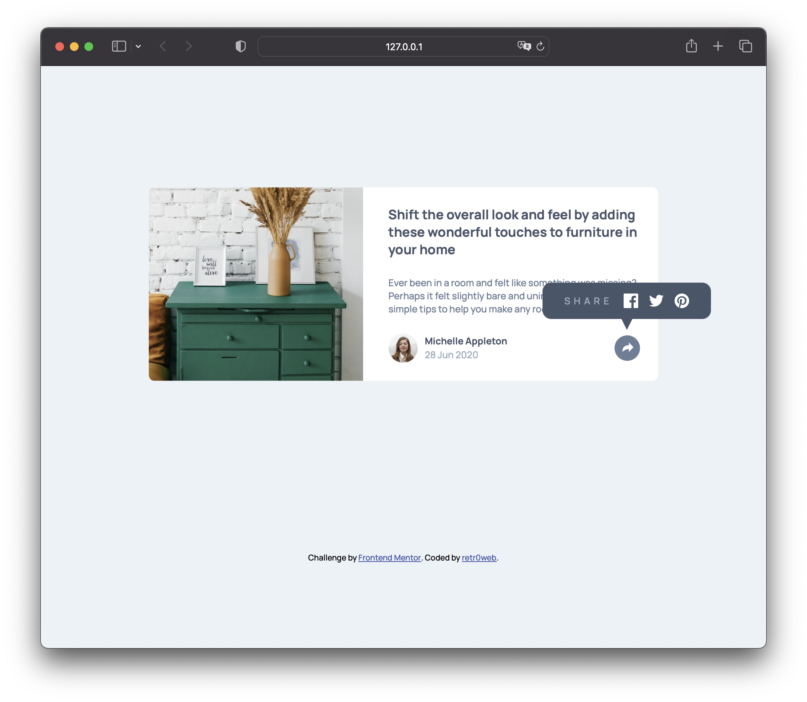

# Frontend Mentor - Article preview component solution

This is a solution to the [Article preview component challenge on Frontend Mentor](https://www.frontendmentor.io/challenges/article-preview-component-dYBN_pYFT). Frontend Mentor challenges help you improve your coding skills by building realistic projects. 

## Table of contents

- [Overview](#overview)
  - [The challenge](#the-challenge)
  - [Screenshot](#screenshot)
- [My process](#my-process)
  - [Built with](#built-with)
  - [What I learned](#what-i-learned)
- [Author](#author)

**Note: Delete this note and update the table of contents based on what sections you keep.**

## Overview

### The challenge

Users should be able to:

- View the optimal layout for the component depending on their device's screen size
- See the social media share links when they click the share icon

### Screenshot



### Links

- Solution URL: [githube repository](https://github.com/retr0web/frontend-mentor-solutions/tree/main/article-component)
- Live Site URL: [github.io hosting](https://retr0web.github.io/frontend-mentor-solutions/article-component/)

## My process

Making the component itself was quite easy, the most challenging part for me was to implement the tooltip and then make it change form on mobile. Thought it took some time to research all the possible solutions, I am satisfied with what was developed in the end.

### Built with

- Semantic HTML5 markup
- CSS custom properties
- Flexbox
- CSS Grid
- Pseudo-elements like ::after
- Clip-path

### What I learned

As mentioned before, the trickiest part was to make a tooltip. At first I thought that the clip-path property would be perfect for the task, but unfortunatelly, with the approach it was used, the border-radius couldn't be saved for bottom corners. After extensive research, I understood that you shouldn't complicate things for yourself and look for a solution that is easier to maintain. So to make an arrow for the tooltip I used ::after and clip-path to turn it into a triangle, so the tooltip has an arrow at the bottom and preserves the border-radius. As for position of the tooltip I chose to make a container for both share button and tooltip, so that when the layout shifts to mobile size, I can easily manipulate the positions of containers to relocate the share section from tooltip, additionally removing the arrow of course. So here is how to make a tooltip with arrow for desktop layout:

```html
<div class="share">
  <svg class="svg-container" xmlns="http://www.w3.org/2000/svg"
    width="35" height="35" viewBox="0 0 35 35">
    <path class="icon" fill="#6E8098"
      d="M15 6.495L8.766.014V3.88H7.441C3.33 3.88 0 7.039 0
         10.936v2.049l.589-.612C2.59 10.294 5.422 9.11 8.39
         9.11h.375v3.867L15 6.495z"/>
  </svg>
  <div class="social-media">
    <h3>Share</h3>
    <a href="https://www.facebook.com"></a>
    <a href="https://twitter.com/"></a>
    <a href="https://www.pinterest.com"></a>
  </div>
</div>
```
```css
.social-media {
    opacity: 0;
    transition: 400ms;
    display: flex;
    justify-content: center;
    align-items: center;
    gap: 15px;
    background-color: var(--very-dark-grayish-blue);
    border-radius: 12px;
    padding: 15px 30px;
    position: absolute;
    top: -70px;
    right: -97.5px;
    pointer-events: none;
}

.social-media::after {
    content: '';
    width: 20px;
    aspect-ratio: 1 / 1;
    background-color: var(--very-dark-grayish-blue);
    clip-path: polygon(100% 0, 0 0, 50% 100%);
    position: absolute;
    bottom: -15px;
    z-index: 1;
}
```

## Author

- Frontend Mentor - [@retr0web](https://www.frontendmentor.io/profile/retr0web)

