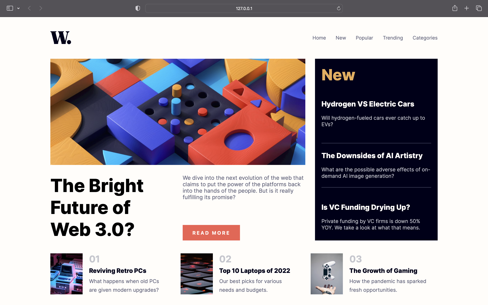

# Frontend Mentor - News homepage solution

This is a solution to the [News homepage challenge on Frontend Mentor](https://www.frontendmentor.io/challenges/news-homepage-H6SWTa1MFl). Frontend Mentor challenges help you improve your coding skills by building realistic projects. 

## Table of contents

- [Overview](#overview)
  - [The challenge](#the-challenge)
  - [Screenshot](#screenshot)
  - [Links](#links)
- [My process](#my-process)
  - [Continued development](#continued-development)
- [Author](#author)

## Overview

### The challenge

Users should be able to:

- View the optimal layout for the interface depending on their device's screen size
- See hover and focus states for all interactive elements on the page

### Screenshot



### Links

- Solution URL: [Github](https://github.com/retr0web/frontend-mentor-solutions/tree/main/news-homepage)
- Live Site URL: [github.io](https://retr0web.github.io/frontend-mentor-solutions/news-homepage/)

## My process

### Continued development

I've encountered a problem with side menu animation. I'm not a big fan of creating 2 menu for desktop and mobile, so usually I just change the style from desktop to mobile without adding or changing html. But with animation this approach became a bit tricky, because when you resize the window on laptop or a tablet, you can see menu open for a second and then it's hidden. Hot fix for it was to remove transition, but it's needed for smooth experience. So until user clicks on mobile menu button, you won't see mobile menu when resizing the window, but when it was clicked, the bug remains. So I'm going to investigate this issue further in order to make this project bug-free.

Here is the code for this 'hack':

```html
      <nav class="navigation">
        <button id="menu-close">
          
        </button>
        <ul>
          <li><a href="#">Home</a></li>
          <li><a href="#">New</a></li>
          <li><a href="#">Popular</a></li>
          <li><a href="#">Trending</a></li>
          <li><a href="#">Categories</a></li>
        </ul>
      </nav>
```

```css
@media all and (max-width: 685px) {
    .overlay.active {
        display: block;
    }

    .navigation {
        display: flex;
        z-index: 10;
        position: fixed;
        right: 0;
        top: 0;
        background-color: var(--off-white);
        flex-direction: column;
        align-items: start;
        height: 100%;
        width: 230px;
        gap: 50px;
        padding-top: 15px;
        transform: translateX(230px);
    }

    .transition-hack {
        transition: transform ease-in-out 450ms;
    }

    .navigation.menu-active {
        transform: translateX(0);
}
```

```js
const menuOpen = document.querySelector('#menu');
const menuClose = document.querySelector('#menu-close');
const navigation = document.querySelector('.navigation');
const overlay = document.querySelector('.overlay');

function openMenu() {
    navigation.classList.add('menu-active');
    navigation.classList.add('transition-hack');
    overlay.classList.add('active');
}

function closeMenu() {
    navigation.classList.remove('menu-active');
    overlay.classList.remove('active');
}

menuOpen.addEventListener('click', openMenu);
menuClose.addEventListener('click', closeMenu);
```

## Author

- Frontend Mentor - [@yourusername](https://www.frontendmentor.io/profile/yourusername)
